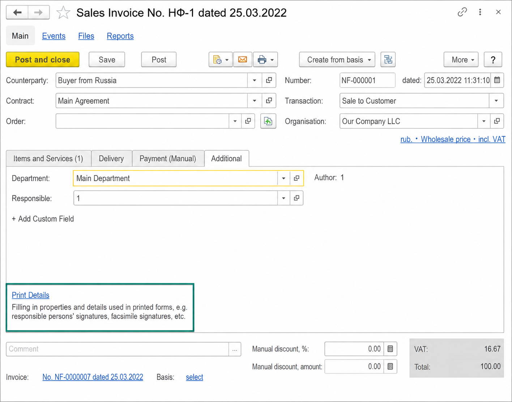
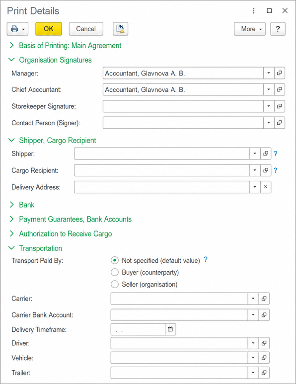
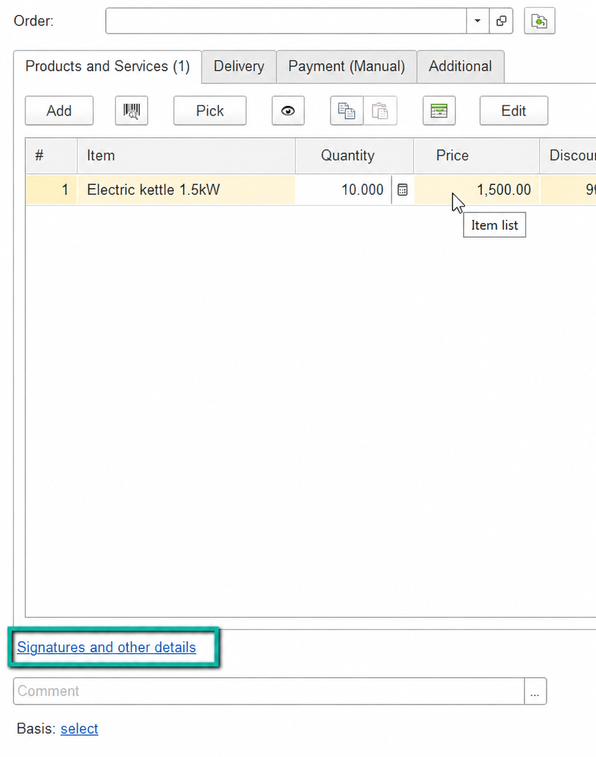
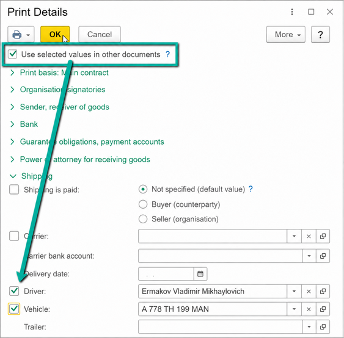
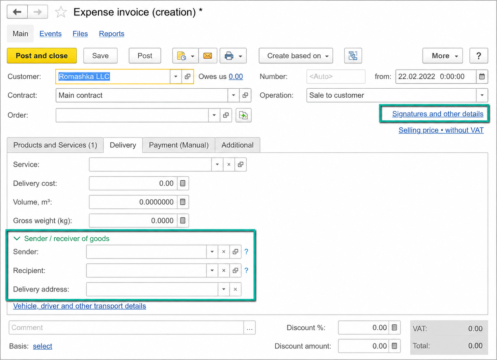
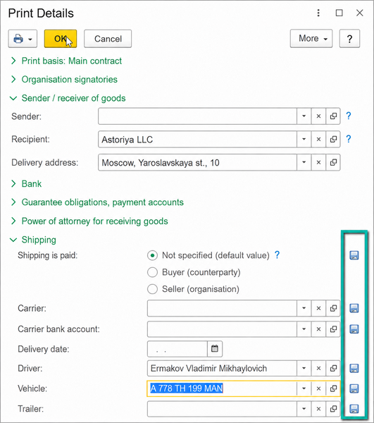
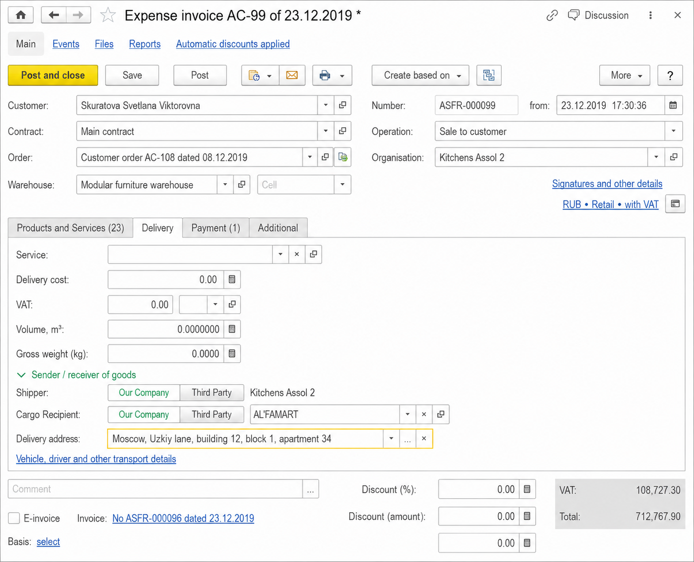
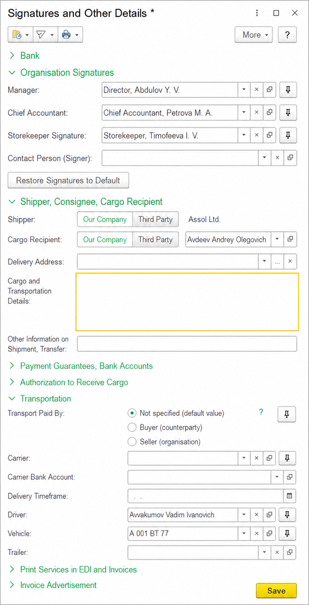
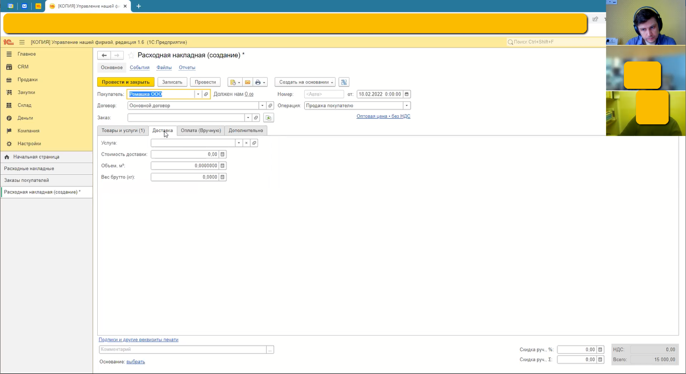

# When Users Can't Find Existing Value

## Redesigning “Print Details” around users’ mental models

**Case type:** Product Discovery · Enterprise UX · UX Research  
**Role:** Product Analyst / UX Designer  
**Product:** ERP system for small and medium-sized businesses  
**Scope:** Document printing and delivery workflow

> The functionality already existed. The problem was that users could not find it where they expected it.

## Context

As part of my role, I continuously monitored user feedback and support requests and maintained a backlog of UX problems.

One recurring issue concerned document printing. Users contacted support because they could not understand how to change information that appeared in printed documents, such as the consignor or consignee.

The capability was already available in the product. The challenge was discoverability: the entry point, terminology and information structure did not match the way users thought about completing the task.

## The problem

The original document form exposed a small link called **Print Details**. It opened a separate form containing signatures, consignor, consignee, delivery and transportation values.

Several issues were connected:

- **The name was ambiguous.** Most document fields were printed anyway, so “Print Details” did not explain what was behind the link.
- **Related information was fragmented.** Organisation and Customer were on the document form, while Consignor and Consignee were hidden in a separate form.
- **Repeated input was required.** Values such as driver and vehicle were often reused but had to be entered again.
- **The default signature model was incomplete.** An organisation could have several authorised signatories, and the selected person sometimes needed to change per document.

## The existing workflow

The entry point was located on the **Additional** tab, below the main document content.

When selected, it opened a separate editing form with expandable sections for signatures, consignor, consignee, banking, guarantees and transportation.

The system’s structure was internally consistent, but users had to understand that structure before they could find the information they needed.

## Investigation

I analysed six competing business applications:

- 1C:Accounting 3.0
- 1C:Trade Management 10.3 and 11
- 1C:Retail
- Kontur.Elba
- My Business
- My Warehouse

The competitors used different patterns. There was no single interface to copy, but the comparison helped identify hypotheses about naming, placement, grouping and reuse of values.

The key design question became:

> How should enterprise software organise information so users can find it where they naturally expect it, rather than where the system happens to store it?

## Prototype 1: make the entry point clearer

The first prototype tested three hypotheses:

1. A more explicit label would make the feature easier to recognise.
2. Signatures would be expected near the bottom of a document, so the link should be placed there.
3. Frequently reused values should be saveable for future documents.

The label changed from **Print Details** to **Signatures and other details** and was positioned below the document table.

The Print Details form also received a mechanism for saving selected values for future documents.

## Usability test #1: our assumptions were wrong

The first moderated usability test challenged all three assumptions.

### Finding 1: users searched by task

The participant looked for shipping and transportation information on the **Delivery** page, rather than in a separate print-related form.

### Finding 2: the footer placement did not work

The participant did not find **Signatures and other details** at the bottom of the form. The assumption that users would look for signatures there was not supported.

### Finding 3: the save interaction was not self-explanatory

The participant could eventually understand the mechanism, but described it as something that was possible to guess rather than immediately clear.

The main insight was:

> Users navigated according to their workflow, not according to the application’s internal information architecture.

## Prototype 2: reorganise around the workflow

The second prototype changed the information architecture instead of only polishing the first solution.

- **Delivery-related information** moved to the Delivery tab.
- The remaining entry point was renamed **Signatures and other details**.
- The entry point moved to the upper-right area of the document header.
- The saving interaction became a field-level action next to the reusable value.

The revised delivery layout made the relationship between Customer, Recipient and Delivery address visible in the place where the participant expected to find it.

## Usability test #2: the navigation pattern improved

In the second test, the participant:

- found the recipient immediately;
- found the delivery address immediately;
- located signatures and other details without prompting;
- understood the revised saving interaction without explanation.

The test also exposed two remaining issues:

- entering a delivery address was difficult because the field’s dropdown interaction did not match expectations;
- when asked to clear the consignee because it matched the customer, the participant copied the Customer value instead, showing that the relationship and clearing behaviour needed refinement.

## Final iteration and validation

I refined the delivery-address interaction and the selection and clearing behaviour for Consignor and Consignee.

The updated form made the current values visible and kept the reusable-value actions close to the fields they affected.

Two additional usability tests were conducted after the second iteration. Their purpose was to validate the refinements with additional users and check whether further usability problems remained.

After the fourth test, no further improvements were identified as necessary, and testing was concluded.

## Outcome

The project did not add a fundamentally new capability. It reorganised existing functionality around the user’s workflow.

The final design:

- made delivery-related values part of the Delivery workflow;
- provided a clearer entry point for signatures and other document details;
- made frequently reused values easier to preserve;
- reduced the need to understand the application’s internal structure before completing the task.

The strongest evidence came from the second test, where the participant immediately found the key delivery fields and located signatures and other details without prompting. The later tests confirmed that the refined design was ready to stop iterating, based on the evidence available in the project documentation.

## My role

I was responsible for:

- monitoring user feedback and maintaining the UX problem backlog;
- analysing the existing workflow and business domain;
- analysing competing products;
- formulating design hypotheses;
- designing prototypes;
- conducting moderated usability tests;
- analysing findings and changing the information architecture;
- iterating and validating the redesigned workflow.

## Reflection

This project reinforced a principle that is especially important in enterprise UX:

> Users search for information according to their workflow — not according to the application’s internal architecture.

The first prototype was based on reasonable assumptions, but testing showed that those assumptions were wrong. The value of usability testing was not simply confirming a finished design; it was reducing uncertainty early enough to change the structure of the solution.

## Methods

**Discovery:** user feedback monitoring, UX problem backlog, problem analysis, domain analysis, competitor analysis  
**Design:** information architecture, wireframing, interactive prototyping, interaction design  
**Validation:** moderated usability testing, iterative testing, evidence-based design decisions

## Key takeaway

> Existing functionality creates little value when users cannot find it.

Good enterprise UX is not necessarily about adding more functionality. It is about making the functionality users already need understandable, discoverable and aligned with the way they work.

### Additional source screens

